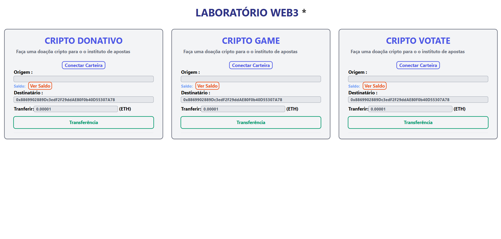

# Projeto de Laboratório Web3 (Em desenvolvimento)

Bem-vindo ao projeto de laboratório Web3! Este repositório contém vários subprojetos: Cripto Donativo, Cripto Game e Cripto Eleição. Cada um desses subprojetos utiliza tecnologias modernas como React, Web3 e Blockchain.

## Tecnologias Utilizadas

- **React**: Biblioteca JavaScript para construção de interfaces de usuário.
- **Web3**: Biblioteca para interagir com a blockchain Ethereum.
- **Blockchain**: Tecnologia de registro distribuído utilizada para garantir a segurança e transparência das transações.

